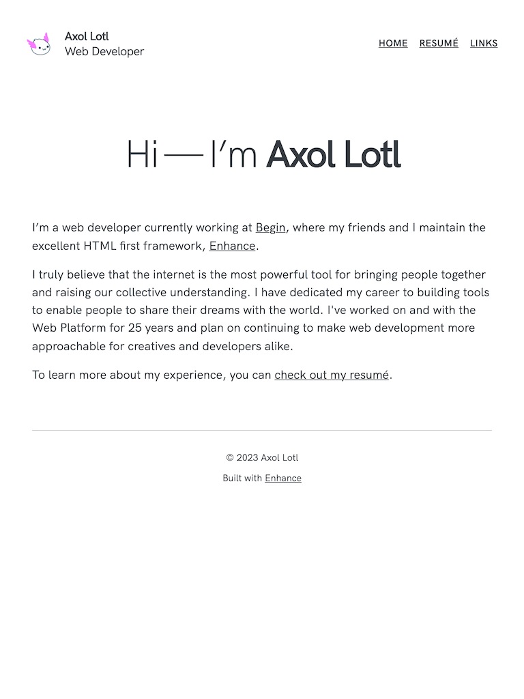

[Module Index](/enhance-workshop)


# Module 1: Workshop Overview

## Agenda:

- Check your development environment
- What We Will Build
- Workshop Objectives
- Why Enhance?


## Preliminary Setup

- How many people completed the preliminary setup?
- Did you have any problems?
- Can everyone run the begin CLI?

## What We Will Build

Today we will be building a multi-page full stack developer portfolio that includes:

  - Multiple HTML pages composed of web components
  - API routes that run as cloud functions
  - Database-backed pages
  - User authentication

Here's a preview of the final product.



See [enhance-workshop.com](enhance-workshop.com)

Or launch the app locally:

  ```bash
  cd enhance-workshop
  npm start
  ```

## Workshop Objectives

1. Standards-based approach
2. HTML-first development for faster velocity
3. Use Custom Elements to build maintainable applications
4. Build and deploy a developer portfolio project


## Why Enhance?

- Standards-based web development that can be used anywhere
- So why use the Enhance framework?
    - Building with components is nice
    - Server-side rendering is critical
    - Complex build toolchains and transpilation are a maintenance nightmare
    - HTML first is the fastest, simplest, and best way to build
    - Orchestrating all the other moving parts is hard (database, IAC, events, …)
