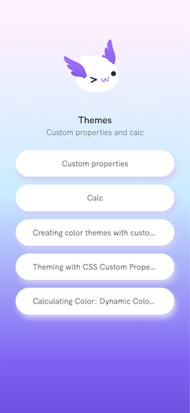
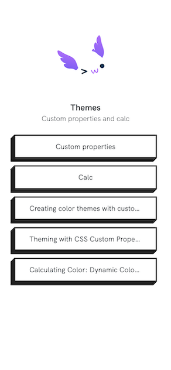

[Module Index](/enhance-workshop)

# Module 11: Putting it all together

So far we've been focusing on individual parts of Enhance. For this module we are going to put it all together and build a new API backed page from scratch. We'll leverage the links we've stored in the database to build out a page of interesting links we can share with everyone.

Like this one about custom CSS properties.



## Getting the data

- We are pretty experienced working with API routes by this point so let's create a new file `app/api/linktree.mjs` and populate it with the following code.

```javascript
import { getLinks } from "../models/links.mjs"

export async function get() {
  const links = await getLinks()
  const publishedLinks = links.filter(link => link.published)
  return {
    json: {
      page: {
        title: 'Themes',
        description: 'Custom properties and calc'
      },
      links:publishedLinks
    }
  }
}
```
- We get to re-use the same database code to list all the links and we'll pass those links along to our page component.
- Speaking of our page component.

## Displaying the links

- Create a new file called `app/pages/linktree.html` and populate it with the folling code.

```html
<linktree-container
  class="
    text-center
    overflow-auto
   "
>
</linktree-container>
```

- Well that's not much code. I guess it is web components all the way down from this point.

## Link components

- Our `app/pages/linktree.html` page only has one tag in it and it is the custom element `linktree-container` so let's create that now.
- Create the file `app/elements/linktree/container.mjs` and populate it with the following code.

```javascript
export default function LinktreeContainer({ html, state }) {
  const { store={} } = state
  const { page={}, links=[] } = store
  const { description='No description yet', title='No title yet' } = page
  const linkItems = links.map(link => {
    const { text='', url='' } = link
    return html`
    <li class="mbe0">
      <linktree-link text="${text}" url="${url}"></linktree-link>
    </li>
  `
  }).join('\n')
  const defaultLink = html`
    <li>
      <linktree-link text="Add some links" url="/login"></linktree-link>
    </li>
    `

  return html`
    <style>
      :host {
        display: block;
        height: 100vh;
        min-inline-size: 20rem;
        padding: 4rem 2rem;
        background-image: var(--linktree-bg-img);
        background-size: cover;
      }
      :host > div > img {
        width: 10rem;
        object-fit: cover;
        border-radius: 100%;
      }
      :host > ul {
        max-inline-size: 50rem;
        margin: auto;
      }
      :host > ul > li {
        border-radius: var(--linktree-link-border-radius);
        box-shadow: var(--linktree-link-shadow);
      }
      :host > ul > li:active {
        box-shadow: none;
        transform: var(--linktree-link-transform);
      }
      .avatar-img {
        content:var(--linktree-avatar-img);
      }

    </style>
    <div class="flex mbe-2 justify-content-center">
      
    </div>
    <h1 class="text1 font-bold mbe-4">
      ${title}
    </h1>
    <p class="text0 font-light mbe3">
      ${description}
    </p>
    <ul class="list-none">
      ${linkItems.length ? linkItems : defaultLink}
    </ul>
  `
}
```

- The real magic of this component is the mapping over the `links` provided by our API route to create a list of links for the container.
- Next we'll create the `app/elements/linktree/link.mjs` file and populate it with:

```javascript
export default function LinktreeLink({ html, state }) {
  const { attrs={} } = state
  const { text='', url='' } = attrs
  return html`
    <style>
      :host > a {
        display: block;
        text-decoration: none;
        padding: 1rem 2rem;
        background-color: var(--linktree-link-bg-color);
        border-width: 3px;
        border-style: solid;
        border-color: var(--linktree-link-border-color);
        border-radius: var(--linktree-link-border-radius);
      }
      :host > a:hover,
      :host > a:active {
        background-color: var(--linktree-link-bg-color-hover);
        border-color: var(--linktree-link-border-color-hover);
      }
    </style>
    <a href="${url}" alt="${text}" class="truncate">${text}</a>
  `
}
```

- The element itself is quite simple as it just returns an styled anchor tag. Eagle eyed workshop attendees may have spotted something new in this component as well as the `linktree-container` element.

## Custom CSS Properties

> Custom properties (sometimes referred to as CSS variables or cascading variables) are entities defined by CSS authors that contain specific values to be reused throughout a document. They are set using custom property notation (e.g., --main-color: black;) and are accessed using the var() function (e.g., color: var(--main-color);).

- In Enhance applications you set these Custom CSS properties in the `styleguide.json` file.
- Open it now and replace.

```json
  "properties": {
    "site-width": "90vw",
    "site-max-width": "1440px",
    "linktree-avatar-img": "url('/_public/axol-wink.svg')",
    "linktree-bg-img":"url('/_public/background.png')",
    "linktree-link-border-radius": "999px",
    "linktree-link-shadow": "4px 8px 11px #d3cef5",
    "linktree-link-border-color": "transparent",
    "linktree-link-border-color-hover": "#FFF",
    "linktree-link-bg-color": "#FFF",
    "linktree-link-bg-color-hover": "transparent",
    "linktree-link-transform": "translate(0, 2px)"
  },
```

with

```json
  "properties": {
    "site-width": "90vw",
    "site-max-width": "1440px",
    "linktree-avatar-img": "url('/_public/axol-wink.svg')",
    "linktree-bg-img":"",
    "linktree-link-border-radius": "1px",
    "linktree-link-shadow": "-1px 1px 0 #222,-2px 2px 0 #222,-3px 3px 0 #222,-4px 4px 0 #222,-5px 5px 0 #222,-6px 6px 0 #222,-7px 7px 0 #222,-8px 8px 0 #222",
    "linktree-link-border-color": "#222",
    "linktree-link-border-color-hover": "red",
    "linktree-link-bg-color": "#FFF",
    "linktree-link-bg-color-hover": "#FFF",
    "linktree-link-transform": "translate(-8px, 8px)"
  },
```

- Restarting your application results in a whole new look for the `/links` page.



### Why are custom properties important

There are two good reasons why you should care about custom properties.

1. Theming: custom properites allow you to easily theme your component by ensuring they are using the same value for css properties like color, border, etc.
2. Shadow DOM: We talked earlier that web components that use the shadow DOM are not affected by the regular cascade of CSS as they are effectively in another DOM. However CSS custom properties can pierce this barrier allowing you to pass in values from the light DOM. This allows you to do consistent style of your light and shadow DOM components.

For more information on CSS custom properties click on any of the default links on the linktree.
