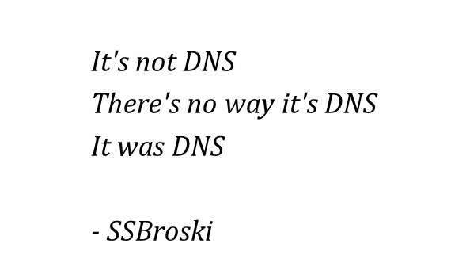

[Module Index](/enhance-workshop)

# Module 12: Deploying and DNS

Up until this point we've been taking advantage of the ability to rapidly prototype our site locally. Now it's time to deploy our application to the cloud.

## Deploying to the Cloud

For this part of the workshop we will use the Begin CLI to deploy your app to Begin's cloud infrastructure which is backed by AWS. We think that using Begin is the easiest way to get your application on AWS but we don't believe in vendor lock-in so we will also provide two escape hatches to enable you to do the deployment yourself.

- To get started type `begin login` into your command prompt or terminal. If this is the first time you've logged into Begin you will need to authorize with GitHub.
- Once you are logged into Begin, we'll do our first deploy. Type `begin deploy` into the terminal. You'll need to answer a few questions to complete the deployment.
- For `Would you like to create a Begin app based on this project? (Y/n)` hit `Enter` or type `y`.
- Give your project a meaningful name when asked `What would you like to name your app?`
- When queried `What would you like to name your first environment?` except the default `staging` by hitting `Enter`.
- Accept the default for `Would you like to specify the geographical region your project will be deployed to? (This cannot be changed) (Y/n)` by hitting `Enter`. This will deploy your app to the Oregon, US region. For a list of all supported regions see [region support](https://begin.com/blog/posts/2023-05-30-region-support-for-begin).
- Then wait a few minutes for your application to be deployed. The initial deploy will take a bit longer than subsequent deployments as the cloud gremlins are busy creating stacks of CloudFormation resources for you.
- Here's an example of what an initial deploy would look like.

```bash
begin deploy
This project doesn't appear to be associated with a Begin app
? Would you like to create a Begin app based on this project? (Y/n) · true
? What would you like to name your app? · workshop-test
? What would you like to name your first environment? · staging
? Would you like to specify the geographical region your project will be deployed to? (This cannot be changed) (Y/n) › false
Added appID 'XXXXXXXX' to project, be sure to commit this change!
Archiving and uploading project to Begin...
Project uploaded, you can now exit this process and check its status with: begin deploy --status
Beginning deployment of 'staging'
Packaging build for deployment
Publishing build to Begin
Build completed!
Deployed 'staging' to: https://xxxxxxxx.begin.app
```

Now you can visit your site at it's deployed URL.

Play around with your site for a bit in production. Huh, did you notice that you can't login? The reason is simple, we have set an environment variable in our staging environment.

## Environment Variables

Back in module 8 we set the `SECRET_PASSWORD` environment variable locally in our `.env` file. Now we need to set that environment variable in our deployed environment. Let's head back over to the command line.

- In order to set an environment variable you'll need to run the `begin env create` command.

```bash
begin env create --env staging --name SECRET_PASSWORD --value secret
Successfully created environment variable SECRET_PASSWORD in 'staging'
```

- You can check to make sure your environment variable was set properly by running.

```bash
workshop-test (app ID: 44B07T74)
└── staging (env ID: P62CMG7RB): https://xxxxxxxx.begin.app
    └── SECRET_PASSWORD=s****
```

- All set right? Nope! In order for your environment variables to become live you will need to redeploy your app.

```bash
begin deploy
```

- Once the deploy completes, and it will run faster this time, you will be able to login.

## Production Environment

We recommend you create a separate environment for production. This way you get to test out new code changes in your staging environment before your users see it in production.

Let's go back to the terminal and use what we learned in the previous two sections in order to create our production environment.

```bash
begin create --env production
begin env create --env production --name SECRET_PASSWORD --value secret
begin deploy --env production
```

> Note: now that we have more that one environment for this application we need to specify which environment we want to deploy.

## Continuous Integration/Continuous Deployment

Begin makes it easier to deploy from CI by providing integration with [GitHub Actions](https://github.com/beginner-corp/actions).

Let's work through an example of how you could use the action in your GitHub workflow. In this example we will assume that you have already created your Begin app and two environments named `staging` and `production`.

### Retrieve your Begin authentication token

On Mac/Linux open:

```
~/.begin/config.json
```

On Windows open:

```
C:\Users\yourusername\begin\config.json
```

and copy the value of `access_token` (without the quotes, of course).

### Create a BEGIN_TOKEN secret on Github

1. On GitHub, navigate to the main page of your app's repository.
1. Under your repository name, click **Settings**.
1. In the **Security** section of the sidebar, select **Secrets**, then click **Actions**.
1. Click **New repository secret**.
1. Type `BEGIN_TOKEN` as the name for your secret in the **Name** input field.
1. Enter the value of your `access_token` for the **Secret** input field.
1. Click **Add secret**.

> Never check in your `access_token` to source code control.

### Example GitHub Actions

You can automatically deploy your code to Begin via GitHub Actions by creating a `.github/workflows/deploy.yml` file in your app's repository.  Our recommended approach is to do tag based deployment. When this GitHub Action is installed all commits to the `main` branch will be deployed to your `staging` environment. When a new tag is created on the repo that will trigger a deploy to `production`.

```yaml
name: Begin deploy

on: [ push, pull_request ]

defaults:
  run:
    shell: bash

jobs:
  # Deploy the build
  deploy:
    runs-on: ubuntu-latest
    if: github.event_name == 'push'

    steps:
      - name: Check out repo
        uses: actions/checkout@v3

      - name: Deploy to staging
        if: github.ref == 'refs/heads/main'
        uses: beginner-corp/actions/deploy@main
        with:
          begin_token: ${{ secrets.BEGIN_TOKEN }}
          begin_env_name: staging

      - name: Deploy to production
        if: startsWith(github.ref, 'refs/tags/v')
        uses: beginner-corp/actions/deploy@main
        with:
          begin_token: ${{ secrets.BEGIN_TOKEN }}
          begin_env_name: production
```

Now, any commit or tag on your `main` branch will automatically update your application so you don't need to execute the `begin deploy` command to see your changes.

## DNS

[](https://www.reddit.com/r/sysadmin/comments/4oj7pv/network_solutions_haiku/d4czk91?utm_source=share&utm_medium=web2x&context=3)

DNS is a PITA! If you've ever struggled setting up DNS for a website you know what I mean. Luckily, the Begin CLI makes it easy to register and assign DNS to your application running on Begin infrastructure.

To add a domain to your app you only need to search for the domain name you want using the CLI.

```bash
begin domain add --domain enhance-workshop.com
```

If the domain is available, you will get a link to checkout and complete the subscription process. If the domain is unavailable, some suggestions will be provided.

This command will not charge a card you might have on file. Similarly, it will not hold the domain for you. You will need to complete the subscription process at the provided checkout URL to claim the domain.

Once you purchase a domain you need to link your domain with an application environment for it to become live.

```bash
begin domains link --domain enhance-workshop.com --env production
```

Once the DNS gremlins are done wiring up everything your site will be live at your requested domain name.

## Escape Hatches

We promised earlier on in the module that there would be escape hatches to avoid vendor lock in.

### Architect

The first escape hatch is [Open JSF Architect](https://arc.codes/docs/en/get-started/quickstart) which is an open source project that makes deploying to AWS much easier. Enhance applications are valid Architect applications so if you have your own AWS credentials and want to deploy to your own account you can use Architect.

Read more at [Deploying](https://arc.codes/docs/en/guides/developer-experience/deployment) on [arc.codes](https://arc.codes).

### AWS

Our second and final escape hatch is AWS itself. You can always deploy directly to AWS without Begin or Architect.

Read more at [ejecting from Architect](https://arc.codes/docs/en/about/ejecting-from-architect).
